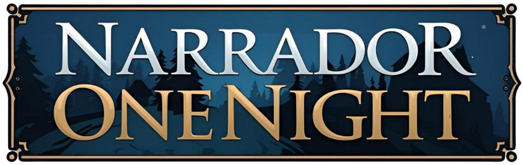

<div align="center">

  

  <h1 style="font-size: 3em; font-weight: 700; color: #E0E0E0; text-shadow: 2px 2px 4px rgba(0,0,0,0.5); margin-bottom: 10px;">
    Narrador OneNight
  </h1>

  <p style="font-size: 1.3em; color: #CCCCCC; max-width: 700px; line-height: 1.5; margin-bottom: 30px;">
    Uma experiência imersiva para o jogo de mesa One Night Ultimate Werewolf.
    Guie suas partidas com narração por voz gerada por IA e uma atmosfera sonora envolvente.
  </p>

  <p>
    <a href="https://narradoronenight.vercel.app" target="_blank" style="text-decoration: none;">
      
    </a>
  </p>

  <!--
  
  -->

  <hr style="width: 70%; border: none; border-top: 3px dashed #556B8D; margin: 50px auto;">

</div>

<div style="max-width: 900px; margin: auto; padding: 0 20px;">

  <h2 style="font-size: 2em; color: #D4AF37; margin-bottom: 25px; text-align: center;">
    ✨ Por Que Usar o Narrador OneNight?
  </h2>

  <table align="center" style="width:100%; border:none; border-spacing: 20px;">
    <tr>
      <td width="33%" style="background-color: #1a2a3a; border-radius: 10px; padding: 25px; vertical-align: top; text-align: center; box-shadow: 0 4px 8px rgba(0,0,0,0.3); border: 1px solid #3a4a5a;">
        <h3 style="color: #E0E0E0; margin-top: 0; font-size: 1.4em;">🗣️ Voz de IA Profissional</h3>
        <p style="color: #CCCCCC; font-size: 1em;">Desfrute de uma narração clara e imersiva com voz gerada por IA de alta qualidade.</p>
      </td>
      <td width="33%" style="background-color: #1a2a3a; border-radius: 10px; padding: 25px; vertical-align: top; text-align: center; box-shadow: 0 4px 8px rgba(0,0,0,0.3); border: 1px solid #3a4a5a;">
        <h3 style="color: #E0E0E0; margin-top: 0; font-size: 1.4em;">⚙️ Configuração Flexível</h3>
        <p style="color: #CCCCCC; font-size: 1em;">Selecione os personagens em jogo para uma narração totalmente personalizada à sua partida.</p>
      </td>
      <td width="33%" style="background-color: #1a2a3a; border-radius: 10px; padding: 25px; vertical-align: top; text-align: center; box-shadow: 0 4px 8px rgba(0,0,0,0.3); border: 1px solid #3a4a5a;">
        <h3 style="color: #E0E0E0; margin-top: 0; font-size: 1.4em;">🌙 Atmosfera Envolvente</h3>
        <p style="color: #CCCCCC; font-size: 1em;">Música ambiente e pausas estratégicas para mergulhar os jogadores na noite.</p>
      </td>
    </tr>
  </table>

  <br><br> <h2 style="font-size: 2em; color: #D4AF37; margin-bottom: 25px; text-align: center;">
    🚀 Tecnologias Utilizadas neste Projeto
  </h2>
  <p align="center" style="margin-bottom: 50px;">
     &nbsp;
     &nbsp;
     &nbsp;
     &nbsp;
    
  </p>


  <h2 style="font-size: 2em; color: #D4AF37; margin-bottom: 25px; text-align: center;">
    💻 Como Rodar o Projeto Localmente
  </h2>

</div>

```markdown
# 1. Clone o repositório
git clone [https://github.com/rafael-s-santos/narrador-onenight.git](https://github.com/rafael-s-santos/narrador-onenight.git)

# 2. Acesse a pasta do projeto
cd narrador-onenight

# 3. Instale as dependências
npm install

# 4. Inicie o servidor de desenvolvimento
npm run dev
```
<div align="center" style="margin-top: 50px; border-top: 1px solid #3a4a5a; padding-top: 20px;">
    <p style="font-size: 1.1em; color: #CCCCCC; margin-bottom: 20px;">
        Desenvolvido por <strong>Rafael Santos</strong>
    </p>
    <p>
        <a href="[https://github.com/rafael-s-santos](https://github.com/rafael-s-santos)" target="_blank">
        
        </a>
    &nbsp;&nbsp;
    </p>
</div>